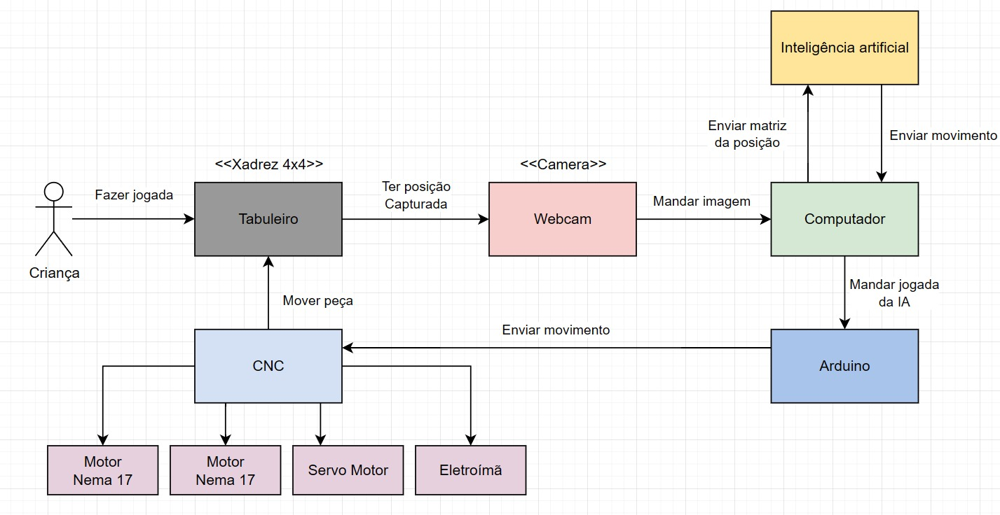

# AutoChess

AutoChess é um protótipo de tabuleiro de MiniChess 4×4 capaz de jogar fisicamente
contra uma pessoa. O sistema combina visão computacional para reconhecer a jogada
humana, uma IA baseada em Q-learning para escolher a resposta e uma estrutura CNC
CoreXY com eletroímã para movimentar as peças.



## Como funciona

O fluxo de uma partida é:

1. a pessoa movimenta uma peça branca no tabuleiro;
2. a câmera captura uma imagem do estado atual;
3. o módulo de visão computacional identifica as peças e deduz a jogada;
4. o motor de MiniChess valida o movimento;
5. a IA escolhe uma jogada para as peças pretas;
6. o controlador converte a jogada em comandos para a CNC, que move a peça.

O jogo utiliza um tabuleiro 4×4 com peões, torres, rainhas e reis. As peças brancas
são controladas pela pessoa e as pretas pela IA.

## Componentes

- **Motor de jogo:** regras, validação de jogadas, xeque, xeque-mate e empate.
- **Inteligência artificial:** agente de Q-learning tabular com avaliação heurística
  de uma jogada.
- **Visão computacional:** OpenCV para localizar o tabuleiro e classificar as peças.
- **Controle físico:** comunicação serial com Arduino e envio de comandos G-code.
- **Simuladores:** interfaces gráficas em Pygame para partidas locais, com ou sem IA.
- **Estrutura mecânica:** modelos do tabuleiro, peças e componentes para fabricação.

## Estrutura do repositório

```text
.
├── core/                         # Aplicação integrada e módulos principais
│   ├── main.py                   # Fluxo câmera → IA → CNC
│   ├── unified_app.py            # Painel visual integrado do robô
│   ├── button_reader.py          # Eventos dos botões físicos
│   ├── hardware_config.py        # Câmera, serial, comandos e coordenadas físicas
│   ├── minichess.py              # Regras do MiniChess 4×4
│   ├── ai_player.py              # Agente de Q-learning
│   ├── train_ai.py               # Treinamento da IA por simulação
│   ├── cv/                       # Visão computacional e imagens de treino/teste
│   ├── models/                   # Modelo persistido da IA
│   └── serial_cnc/               # Controlador serial e firmware do Arduino
├── minichess_simulator/
│   ├── minichess/                # Simulador pessoa contra pessoa
│   └── minichess_ia/             # Simulador pessoa contra IA
├── modelos/                      # Arquivos 3D e modelos do tabuleiro
├── proposta/                     # Propostas e documentação do projeto
└── defesa/                       # Artigo, apresentação e vídeo
```

## Requisitos

Para executar o software:

- Python 3;
- uma webcam compatível com OpenCV;
- Arduino conectado por USB e programado com o firmware do projeto;
- mecanismo CNC/CoreXY com servo e eletroímã.

Os simuladores gráficos não precisam do hardware físico.

## Instalação

Clone o repositório e crie um ambiente virtual:

```bash
git clone <URL-DO-REPOSITORIO>
cd autochess
python3 -m venv .venv
source .venv/bin/activate
python -m pip install --upgrade pip
python -m pip install -r core/requirements.txt
```

No Windows, ative o ambiente com:

```powershell
.venv\Scripts\activate
```

## Executando o sistema completo

Conecte a câmera e o Arduino, posicione o mecanismo na origem configurada e execute
a aplicação a partir da pasta `core`:

```bash
cd core
python main.py
```

A aplicação procura automaticamente a CNC nas portas seriais disponíveis. Índice e
orientação da câmera, porta serial, comandos do firmware, velocidade e coordenadas
da CNC ficam centralizados em `core/hardware_config.py`. Use `SERIAL_PORT = None`
para autodetecção ou informe explicitamente uma porta como `/dev/ttyUSB0` ou
`COM3`.

Durante a partida, use:

- `0` para capturar e processar a jogada;
- `1` para iniciar uma nova partida;
- `2` para apagar o aprendizado salvo e reiniciar a IA;
- `q` para encerrar.

### Painel unificado

O painel reúne o tabuleiro lógico, a última imagem processada pelo CV, a IA, a
CNC e os botões físicos:

```bash
cd core
python unified_app.py
```

Configure `SERIAL_PORT` para a CNC e `BUTTONS_SERIAL_PORT` para o Arduino dos
botões em `hardware_config.py`. As portas devem ser diferentes. Os botões enviam
`BUTTON_0`, `BUTTON_1` e `BUTTON_2`; mouse e teclado executam os mesmos comandos.

Para testar toda a interface e jogar contra a IA sem hardware:

```bash
python unified_app.py --simulate
```

Também é possível abrir uma imagem no painel de CV durante a simulação:

```bash
python unified_app.py --simulate \
  --cv-image cv/assets/storage/testing-chessboards/chessboard_allpieces.jpg
```

Use `--no-camera`, `--no-cnc` ou `--no-buttons` para testar apenas partes da
montagem.

> **Atenção:** antes do primeiro movimento, confira a origem, os limites e o sentido
> dos eixos da CNC. Revise `core/hardware_config.py` sempre que mudar a montagem,
> a câmera ou o firmware.

## Executando os simuladores

### Pessoa contra pessoa

```bash
cd minichess_simulator/minichess
python -m pip install -r ../../core/requirements.txt
python main.py
```

### Pessoa contra IA

```bash
cd minichess_simulator/minichess_ia
python -m pip install -r requirements.txt
python main.py
```

Nas interfaces, selecione uma peça com o mouse e clique em uma das casas destacadas
para realizar a jogada.

## Treinando a IA

O agente pode ser treinado sem câmera ou CNC, enfrentando um oponente aleatório:

```bash
cd core
python train_ai.py --games 1000 --seed 0
```

Por padrão, o modelo é salvo em `core/models/minichess_ai_model.pkl`. Use
`--model caminho/do/modelo.pkl` para escolher outro arquivo e `--max-plies` para
limitar a duração de cada partida simulada.

## Testes

Os testes do motor, da IA e do painel usam `unittest`:

```bash
cd core
python -m unittest test_ai.py test_unified_app.py
```

Também há scripts experimentais de câmera, visão e CNC em `core/test_*.py`,
`core/cv/` e `core/serial_cnc/`. Alguns deles dependem do hardware conectado e da
calibração do protótipo.

## Firmware

Os sketches usados pelo controlador estão em:

- `core/serial_cnc/arduino-cli/firmware_hibrido/firmware_hibrido.ino`;
- `core/serial_cnc/arduino-cli/grblUpload/grblUpload.ino`.

Grave no Arduino o firmware adequado à montagem antes de iniciar a aplicação
integrada. A comunicação serial utiliza `115200` baud por padrão.

## Documentação e materiais

- Artigo final: `defesa/artigo_final/output/main.pdf`;
- apresentação: `defesa/apresentacao/main.pdf`;
- vídeo do projeto: `defesa/video/video_autochess.mp4`;
- modelos para fabricação: `modelos/`.

## Estado do projeto

Este repositório contém um protótipo acadêmico. A precisão da visão computacional e
as coordenadas da CNC dependem da iluminação, do posicionamento da câmera e da
calibração mecânica de cada montagem.
